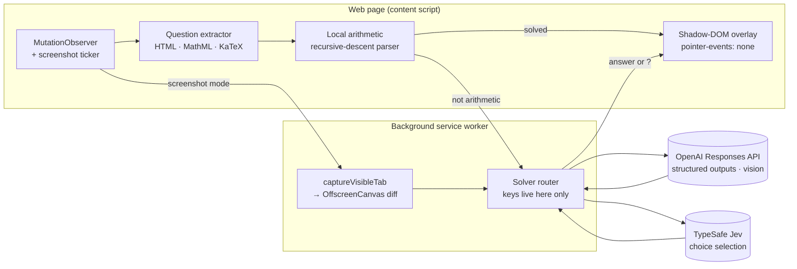

# Jev MCQ Overlay

**Live answers for the multiple-choice question on your screen.**

A Chrome extension that watches the page you're studying on, figures out the current question, in any subject, and shows the answer in a small click-through card in the corner. When the next question appears, the answer updates on its own. It is strictly **read-only**: it never clicks, types, selects or submits anything. You stay in control of every answer.

```
┌──────────────────────────────────────────────┬──────────────┐
│  Q7. Two fair dice are rolled. Given that at │  B           │
│  least one shows 4, what is P(sum = 9)?      │  2/11        │
│                                              │  3.8 s       │
│   ○ A) 1/6     ○ B) 2/11                     └──────────────┘
│   ○ C) 1/9     ○ D) 1/11                                    │
└─────────────────────────────────────────────────────────────┘
```

## Features

- **Any subject, any site.** Math, science, history, language, general knowledge. It works on ordinary quiz pages with no per-site setup.
- **Three ways to read a question**, from fastest to most general:
  - **Local arithmetic**: a safe expression parser answers drills like `23 × 47` in under a millisecond with no network call.
  - **HTML reading**: finds the visible question and its A–F choices in the page, including MathML, KaTeX and super/subscripts, and asks an LLM.
  - **Live screenshot mode**: for questions drawn as images or canvas. It watches the tab, waits for a new question to settle, and sends a single screenshot to a vision model that reads and answers it.
- **Two-model agreement.** The LLM answers the question, then [Jev](https://docs.typesafe.ai/api) picks the matching choice on its own. If the two disagree, or confidence is below 0.8, nothing is shown instead of a guess.
- **Smart change detection.** Screenshot mode compares thumbnails and visible text, so a new question triggers a solve but hovering, clicking a radio button or a ticking timer doesn't. You only pay for new questions.
- **Stays out of the way.** The overlay lives in a shadow DOM with `pointer-events: none`, so the page underneath still gets every click. Stale answers are cancelled the moment the question changes.
- **Clear failures.** When it can't answer, the popup says why, e.g. *"model saw: … choices: …"*, *"Jev chose C, LLM chose B"* or *"HTTP 429"*.

## Quick start

Requires Node.js 20+ and Chrome.

```sh
git clone https://github.com/vvinjam1/jev-mcq-overlay.git && cd jev-mcq-overlay
npm install
npm run build
```

1. Open `chrome://extensions`, turn on **Developer mode**, click **Load unpacked**, and pick the `dist/` folder.
2. Open the extension popup. Under **LLM answers**, paste an [OpenAI API key](https://platform.openai.com/api-keys), tick **Enable**, and save. Optionally add a [TypeSafe](https://typesafe.ai) key under **Jev** for the second opinion.
3. Go to a quiz page and click **Start on this page**.
4. For image or canvas questions, tick **Live screenshot mode** first.

| Shortcut | Action |
| --- | --- |
| <kbd>⌘</kbd> <kbd>⇧</kbd> <kbd>J</kbd> | Show or hide the overlay |
| <kbd>⌘</kbd> <kbd>⇧</kbd> <kbd>K</kbd> | Screenshot and solve the current screen now |

Use <kbd>Ctrl</kbd> instead of <kbd>⌘</kbd> on Windows and Linux. Shortcuts can be changed at `chrome://extensions/shortcuts`.

### Try it without a quiz site

```sh
npm run demo
```

- **http://127.0.0.1:4173/?extension=1**: a test page with arithmetic, probability, matrix and calculus questions, driven by the installed extension.
- **http://127.0.0.1:4173/practice**: a small practice quiz with explanations.

## How it works

1. **Detect.** A `MutationObserver` notices when the page changes. On large pages, scans that take longer than 8 ms are throttled to at most every 250 ms. In screenshot mode, the page asks for a frame every 600 ms instead.
2. **Read.** The question comes from the page HTML, or from a screenshot with the overlay blanked out.
3. **Solve.** Arithmetic is evaluated locally. Everything else goes to OpenAI's Responses API with a strict JSON schema: `{ answer, choice, confidence }`, plus the transcribed question and choices for screenshots.
4. **Verify.** Jev independently maps the answer to a choice. If the two models disagree, or confidence is low, the result is `?`.
5. **Show.** The card updates. A generation counter makes sure a slow answer to an old question never overwrites a newer one.

## Privacy

- API keys are stored in `chrome.storage.local` on your machine and are only read by the background service worker. Pages and page scripts never see them.
- Only the question and choices, or the screenshot in screenshot mode, go to OpenAI, with `store: false`. Jev receives the question, the proposed answer and the choices. Local arithmetic never leaves the browser.
- The extension runs on a site only after you click **Start** or press the solve shortcut, using Chrome's `activeTab` permission. It has no all-sites access.

## Limits

- LLM answers can be wrong, especially on niche or recent facts, and confidence scores are the model's own estimate. For harder material, raise the reasoning effort in the popup.
- Answers take about 3–8 s each. Only local arithmetic is instant.
- Screenshot mode sees only the visible part of the active tab, and each new question is a paid image request.
- HTML reading needs exactly one question on screen at a time.

## Development

```sh
npm run typecheck   # tsc --noEmit
npm test            # 94 Vitest + jsdom tests (providers mocked)
npm run build       # esbuild → dist/, then verify the bundle
npm run check       # all three
```

`verify-build` fails the build if any bundle contains `eval`, `new Function`, or code that clicks, focuses, dispatches events or submits forms. Read-only is enforced, not just promised.

## Architecture



| Layer | Built with |
| --- | --- |
| Extension | Chrome Manifest V3: service worker, `activeTab`, `scripting`, `commands`, `storage` |
| Language and build | TypeScript, esbuild |
| Page reading | `MutationObserver`, `checkVisibility()`, TreeWalker, MathML/KaTeX/TeX annotation parsing |
| Screen capture | `chrome.tabs.captureVisibleTab`, `OffscreenCanvas`, grayscale thumbnail diffing with a word-level text diff |
| Reasoning | OpenAI Responses API: `gpt-5.4-mini` by default, strict JSON Schema outputs, image input, configurable reasoning effort |
| Answer checking | TypeSafe Jev (`/v1/systemone`) for choice selection |
| UI | Shadow DOM overlay, popup settings page |
| Tests | Vitest, jsdom, mocked HTTP |

```
src/
├── background.ts        service worker: provider calls, key access, shortcuts
├── content/             observer, question extractor, math-aware text reader
├── vision/              screenshot capture, change detection, solve loop
├── solver/              router, local arithmetic, LLM → Jev agreement
├── providers/           OpenAI adapter, diagnostics
├── jev/                 Jev client
└── overlay/             the answer card
```
